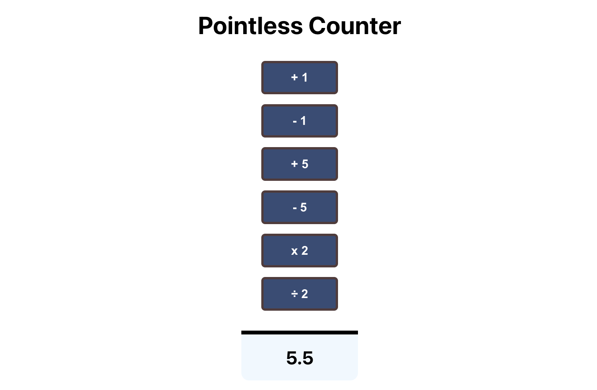

# REACT COUNTER 
This is a basic counter project that changes the count based on the buttons clicked. There are plus, minus, multiply & divide buttons. All of which update the count state.

### Topics Covered
- useState()
- setting and changing state 
- onClick event handlers
- functional Components

